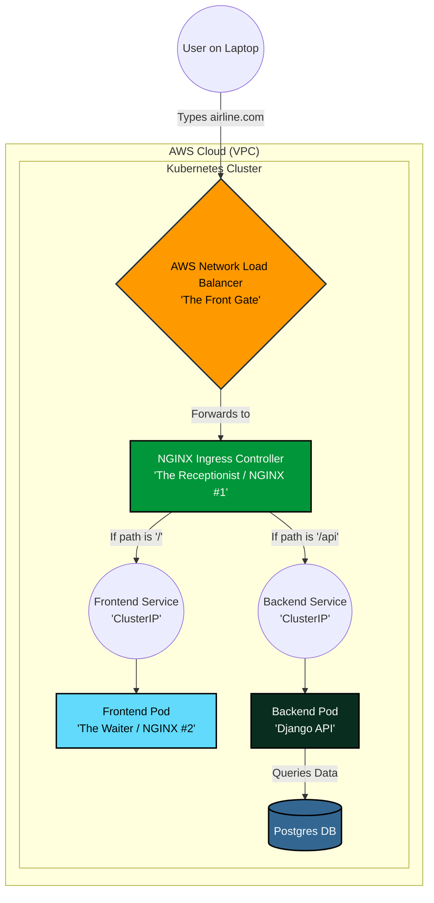

# Understanding Your Cloud Architecture (Beginner's Guide)

It is completely normal to feel overwhelmed! When people say "Load Balancer" or "NGINX" in DevOps, they often use the same word to describe three completely different things. 

Let's clear up the confusion by tracing exactly what happens when a user clicks a button on your website. 

Think of your AWS cluster as a **Massive Office Building**.

---

## The "Two NGINXs" Confusion
The biggest source of confusion is that we are using a software called **NGINX** in two completely different places for two completely different reasons.

1. **NGINX #1 (The Ingress Controller / The Receptionist):** This NGINX sits at the very front of the building. It doesn't host any websites. Its ONLY job is to look at the URL and say: *"Oh, you want `/api`? Go to the backend floor. You want `/`? Go to the frontend floor."* 
2. **NGINX #2 (Inside your Frontend Pod / The Waiter):** This NGINX lives deep inside a private room. Its ONLY job is to hold your compiled React `.html` and `.js` files and hand them to whoever asks for them. It doesn't route traffic.

---

## The Request Journey (Step-by-Step)

Here is the exact path a single request takes when a user tries to log in.

### Step 1: The AWS Load Balancer (The Front Gate)
* **What it is:** A physical piece of Amazon hardware.
* **Its Job:** It is the only thing connected to the public internet. It catches electricity/internet-traffic from the outside world and funnels it safely into your Kubernetes cluster. It has no brain; it just pushes traffic forward.

### Step 2: The Ingress Controller (The Receptionist / NGINX #1)
* **What it is:** The software we installed using that long internet URL.
* **Its Job:** It catches the traffic dropped off by the AWS Load Balancer. It looks at the `ingress.yaml` map we gave it. It sees the user is asking for `/api/auth/login/`, so it directs the user into the private Backend hallway.

### Step 3: The Services (The Hallway Doors)
* **What they are:** Your `backend-service` and `frontend-service` (Both set to `ClusterIP`).
* **Their Job:** They act as permanent doors to your Pods. Even if your Django Pod crashes and Kubernetes replaces it, the door stays in the exact same place. 

### Step 4: The Pods (The Workers)
* **What they are:** The actual Docker containers running your code.
* **Their Job:** 
    * If the traffic went to the Frontend door, **NGINX #2** hands them the React website.
    * If the traffic went to the Backend door, **Django** calculates the login, checks the Postgres database, and sends the "Success" token all the way back up the chain to the user!
